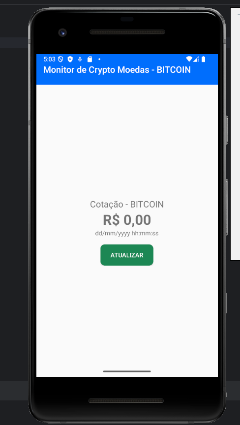
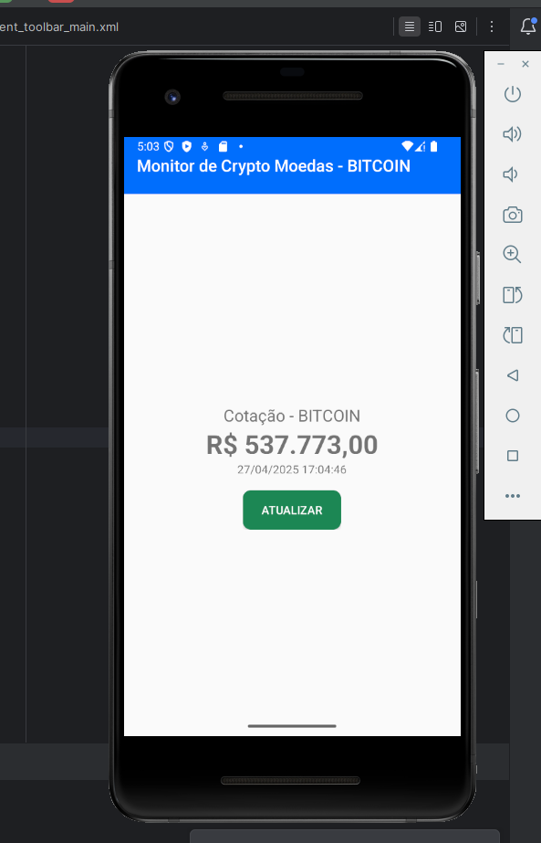

# 📱 android-cryptomonitor

Aplicativo Android para acompanhar a cotação do Bitcoin em tempo real.

---

## 🏠 Tela Inicial

> Exibe o valor atual do Bitcoin assim que o app é aberto.



---

## 🔄 Atualização da Cotação

> Após clicar no botão "Atualizar", o valor do Bitcoin, data e hora são atualizados automaticamente.



---

## 🧐 O que é o android-cryptomonitor?

O **android-cryptomonitor** é um app Android desenvolvido para exibir a cotação atualizada do Bitcoin com apenas um toque.  
Ao clicar no botão **"Atualizar"**, o app consulta a **API do Mercado Bitcoin** e mostra:

- 💲 Valor mais recente do Bitcoin
- 🗓️ Data e hora da última atualização

Tudo em tempo real e com visual simples! 📈⏰

---

## ⚙️ Como funciona?

- Utiliza **Retrofit** para chamadas HTTP 🌐
- Converte JSON com **Gson** 📦
- Atualiza a interface com **Kotlin Coroutines** ⚡

---

## 🛠️ Modelo de Dados: `TickerResponse`

A resposta da API é mapeada da seguinte forma:

```kotlin
class TickerResponse(
    val ticker: Ticker
)

class Ticker(
    val high: String,
    val low: String,
    val vol: String,
    val last: String,
    val buy: String,
    val sell: String,
    val date: Long
)
```


# 🌎 Serviço de Comunicação com a API

## Kotlin

```kotlin
import retrofit2.Response
import retrofit2.http.GET
import gustavolucenadev.com.github.cryptomonitor.model.TickerResponse

interface MercadoBitcoinService {
    @GET("api/BTC/ticker/")
    suspend fun getTicker(): Response<TickerResponse>
}
```

## ⚙️ Como funciona

Ao clicar no botão **"Atualizar"**, o app:

- Faz uma **requisição assíncrona** usando `CoroutineScope`;
- Atualiza a interface com:
  - 💰 Cotação formatada em **Real brasileiro** com `NumberFormat`;
  - 🕒 **Data e hora** da última atualização, formatadas com `SimpleDateFormat`.

---

## 🔍 Exemplo de código

```kotlin
// Formata o valor da moeda
val numberFormat = NumberFormat.getCurrencyInstance(Locale("pt", "BR"))
lblValue.text = numberFormat.format(lastValue)

// Formata a data e hora
val date = tickerResponse?.ticker?.date?.let { Date(it * 1000L) }
val sdf = SimpleDateFormat("dd/MM/yyyy HH:mm:ss", Locale.getDefault())
lblUpdated.text = sdf.format(date)
```
